# Soporte Telecom

Sistema integral de **soporte al cliente para el sector de telecomunicaciones**: gestión de tickets, chat en tiempo real con **chatbot de Nivel 1 (Google Gemini)**, base de conocimiento y panel de administración con métricas y automatizaciones.

<p>
  <a href="https://soporte-telecom.vercel.app"></a>
  
  
  
  
  
</p>

**Demo en producción:** https://soporte-telecom.vercel.app
**Repositorio:** https://github.com/jjavdev/Soporte-Telecom
**Proyecto académico** — Ingeniería de Software I · ING. Dubraska Roca · CIVA 2026

---

## Tabla de Contenidos

1. [Objetivo](#objetivo)
2. [Demo](#demo)
3. [Funcionalidades](#funcionalidades)
4. [Stack Tecnológico](#stack-tecnológico)
5. [Arquitectura](#arquitectura)
6. [Estructura del Proyecto](#estructura-del-proyecto)
7. [Modelo de Datos](#modelo-de-datos)
8. [Chatbot Nivel 1 (Gemini AI)](#chatbot-nivel-1-gemini-ai)
9. [Automatizaciones](#automatizaciones)
10. [Roles y Seguridad](#roles-y-seguridad)
11. [Testing](#testing)
12. [Instalación](#instalación)
13. [Variables de Entorno](#variables-de-entorno)
14. [Scripts Disponibles](#scripts-disponibles)
15. [Despliegue](#despliegue)
16. [Troubleshooting](#troubleshooting)
17. [Limitaciones conocidas](#limitaciones-conocidas)
18. [Documentación del Proyecto](#documentación-del-proyecto)

---

## Objetivo

Reducir la saturación del soporte de **primer nivel** en telecomunicaciones implementando un **chatbot con inteligencia artificial** que resuelva incidencias simples automáticamente (reinicio de router, cambio de clave Wi-Fi, consulta de saldo) y **escale a agentes humanos** cuando sea necesario. Complementado con gestión de tickets, base de conocimiento de auto-servicio, automatizaciones y métricas.

**Problema que resuelve:** ~70% de las consultas son repetitivas; sin automatización se generan colas telefónicas largas, churn y costos operativos altos.

---

## Demo

| | |
|---|---|
| **URL** | https://soporte-telecom.vercel.app |
| **Usuario demo (admin)** | `admin@soporte.com` / `Admin123!` |
| **Usuario demo (agente)** | `agente@soporte.com` / `Agente123!` |
| **Usuario demo (cliente)** | `cliente@soporte.com` / `Cliente123!` |

Capturas reales de la aplicación:

| Login | Dashboard | Crear Ticket |
|:---:|:---:|:---:|
| 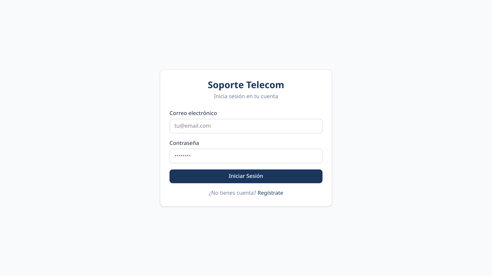 |  | 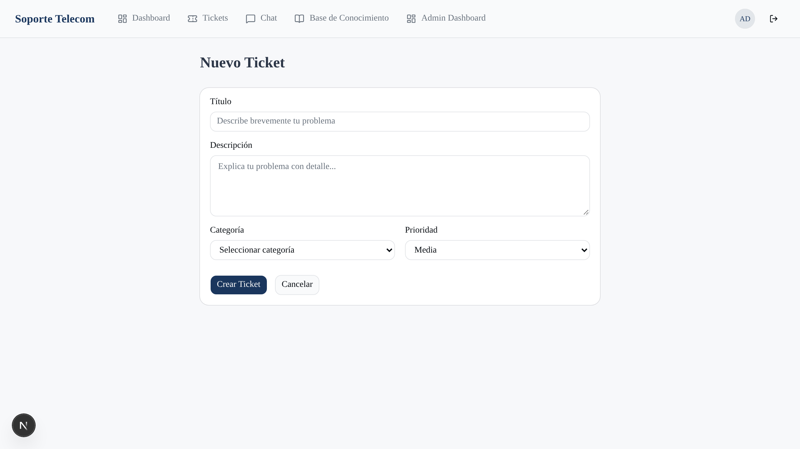 |

| Chat con Chatbot | Base de Conocimiento | Panel Admin |
|:---:|:---:|:---:|
|  | 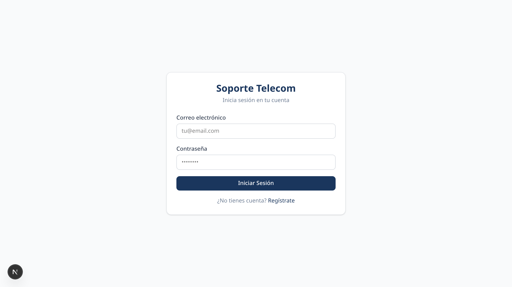 | 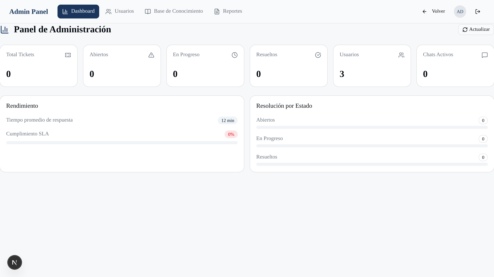 |

---

## Diseño Responsivo (Mobile-First)

La UI se construyó **primero para móvil** y escala a tablet y escritorio:

| Dispositivo | Ancho | Adaptaciones |
|-------------|-------|--------------|
| Móvil | `< 768px` | Header compacto + menú lateral (`Sheet`) + barra inferior con `safe-area`; 1 columna; tarjetas en vez de tablas; filtros apilados; controles 40-44px |
| Tablet | `768–1023px` | Header de escritorio; grid 2 columnas; tablas con scroll |
| Escritorio | `≥ 1024px` | Navegación completa; contenedor `max-w-7xl`; grids 3-6 columnas; tablas densas |

| Móvil (390px) | Tablet (768px) | Escritorio (1440px) |
|:---:|:---:|:---:|
| 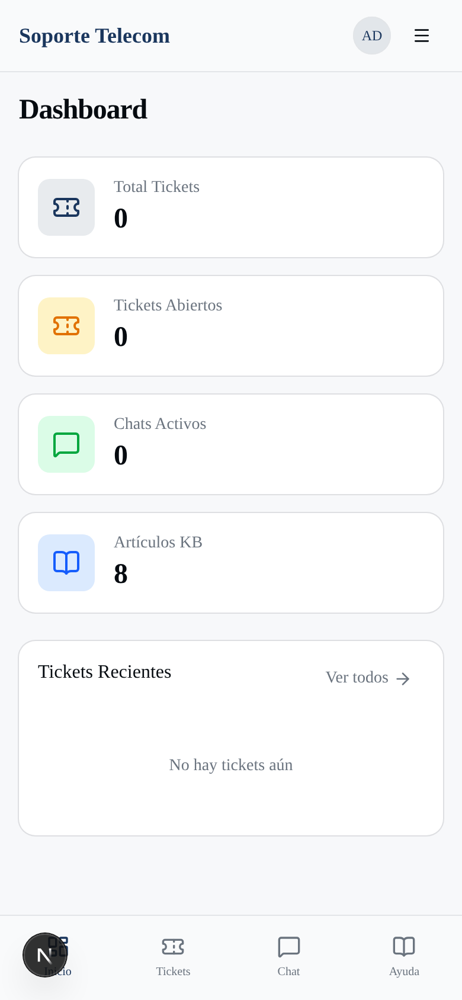 | 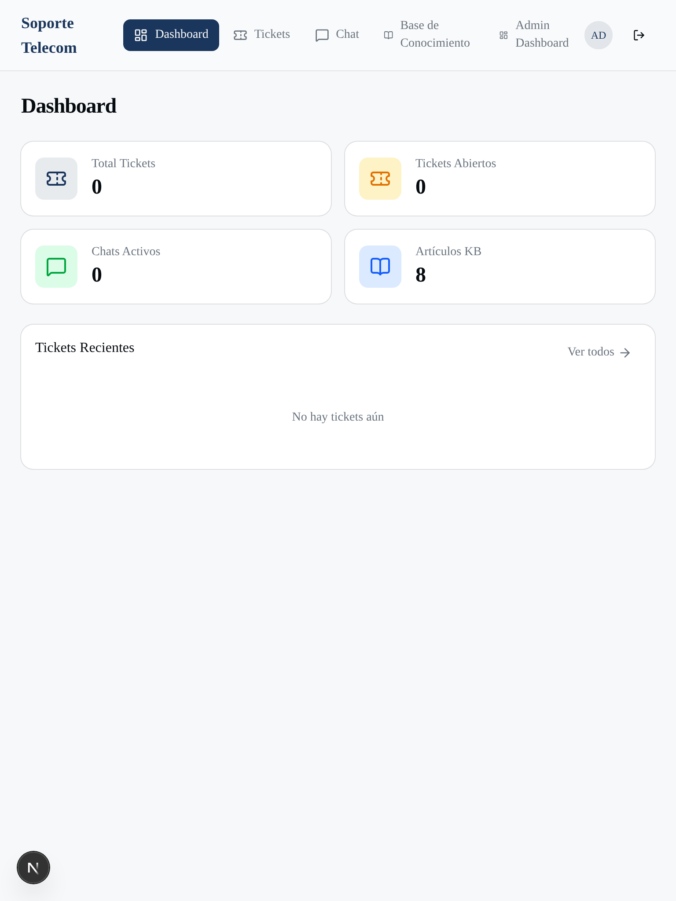 | 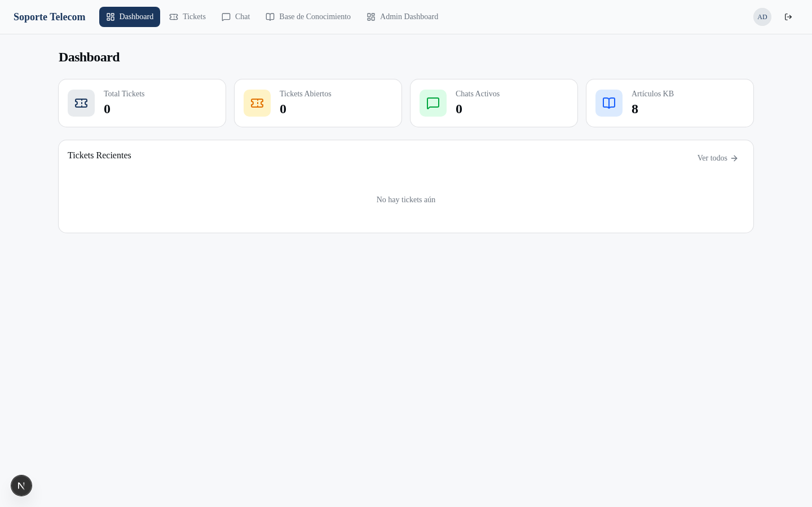 |

Para regenerar las capturas responsivas: `.venv/bin/python scripts/capture-responsive.py`.

## Funcionalidades

### Cliente (`customer`)
- **Autenticación** — Registro e inicio de sesión con Supabase Auth.
- **Tickets** — Crear tickets (categoría, prioridad, título, descripción) y dar seguimiento a su historial.
- **Chat en vivo** — Conversación con el chatbot de Nivel 1 (IA) y escalamiento a agente humano.
- **Base de conocimiento** — Artículos de auto-servicio organizados por categorías, con búsqueda.

### Agente (`agent`)
- **Gestión de tickets** — Listar, filtrar (estado/prioridad) y atender los tickets asignados.
- **Comentarios** — Notas públicas e internas en cada ticket.
- **Chat** — Atender sesiones de chat en tiempo real (Supabase Realtime).

### Administrador (`admin`)
- **Dashboard** — Métricas globales: total de tickets, abiertos, chats activos, artículos KB.
- **Gestión de usuarios** — Crear/editar usuarios, cambiar rol y estado (activo/inactivo/suspendido).
- **Base de conocimiento** — CRUD completo de artículos (crear, editar, eliminar).
- **Reportes** — Tickets por estado y prioridad en el panel de administración.

> El rol `supervisor` está definido en el modelo de datos y es asignable desde el panel, pero aún no cuenta con una vista dedicada.

---

## Stack Tecnológico

| Capa | Tecnología | Versión |
|------|-----------|---------|
| Frontend | Next.js (App Router, RSC + Turbopack) | 16.3.4 |
| UI | React | 19.2.8 |
| Lenguaje | TypeScript (strict) | 5.x |
| Estilos | Tailwind CSS | 4.x |
| Componentes | shadcn/ui + Base UI | — |
| Estado global | Zustand | 5.x |
| Formularios | React Hook Form + Zod | 7.x / 3.x |
| Base de datos | Supabase (PostgreSQL + RLS) | — |
| Auth | Supabase Auth | — |
| Tiempo real | Supabase Realtime | — |
| IA Chatbot | Google Gemini API (`gemini-2.5-flash`) | — |
| Automatización | n8n (Docker) + PostgreSQL triggers + `pg_cron` | — |
| Testing | Vitest + React Testing Library (jsdom) | 5.x |
| Despliegue | Vercel | — |

---

## Arquitectura

Arquitectura en capas: SPA/SSR en Next.js, Supabase como backend (Auth, Postgres, Realtime), y n8n como motor de automatización e integración con IA.

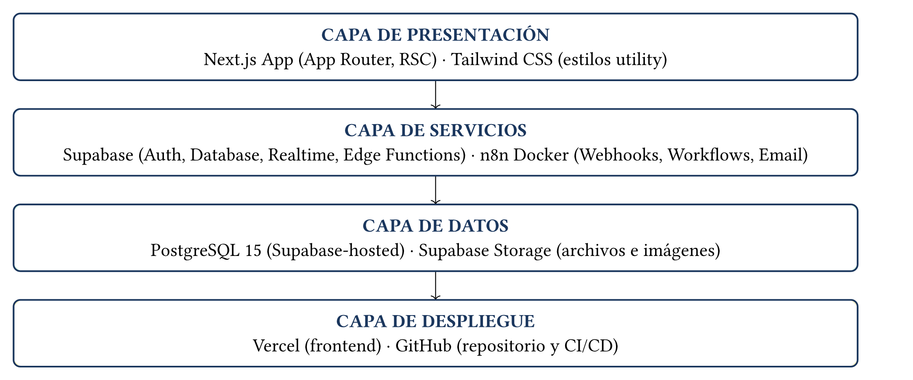

**Flujo de datos general:**

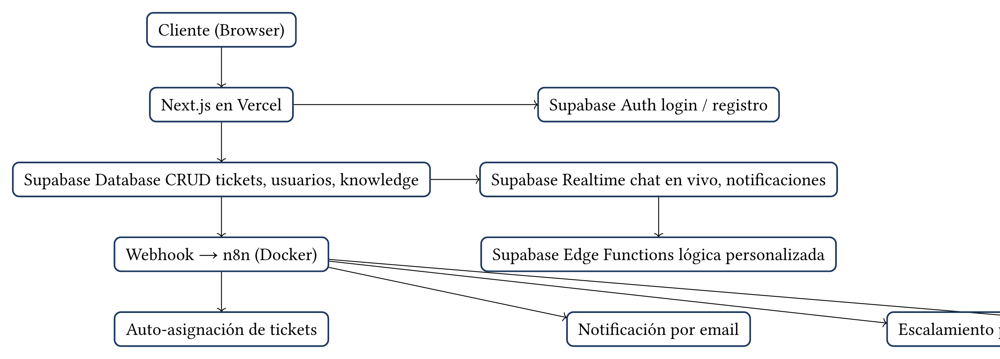

- **Capa de presentación** — Next.js (App Router) + Tailwind. Server Components para datos, Client Components para interactividad.
- **Capa de servicios** — Supabase (Auth, PostgreSQL, Realtime, Edge Functions) y n8n (webhooks + workflows).
- **Capa de datos** — PostgreSQL gestionado por Supabase, con RLS por rol.
- **Despliegue** — Vercel (frontend) + GitHub (repositorio y CI/CD).

---

## Estructura del Proyecto

```
soporte-telecom/
├── src/
│   ├── app/
│   │   ├── (auth)/                  # Login, Register
│   │   ├── (dashboard)/             # Panel principal (protegido)
│   │   │   ├── page.tsx             # Dashboard con métricas
│   │   │   ├── tickets/             # Lista, creación y detalle de tickets
│   │   │   ├── chat/                # Chat con chatbot + agente
│   │   │   └── knowledge/           # Base de conocimiento (+ [slug])
│   │   └── admin/                   # Panel de administración
│   │       ├── page.tsx             # Dashboard admin
│   │       ├── users/               # Gestión de usuarios
│   │       ├── knowledge/           # CRUD de artículos
│   │       └── reports/             # Reportes
│   ├── components/
│   │   ├── ui/                      # Componentes shadcn/Base UI
│   │   └── ...
│   ├── hooks/                       # useAuth, useTickets, useChat
│   ├── stores/                      # authStore (Zustand)
│   ├── lib/
│   │   ├── constants.ts             # Colores de estado y rol
│   │   ├── utils.ts                 # cn() y helpers
│   │   └── supabase/                # client, server, middleware
│   ├── types/database.ts            # Tipos del schema
│   └── middleware.ts                # Protección de rutas (auth)
├── tests/                           # Tests automatizados (Vitest)
│   ├── mocks/supabase-mock.ts
│   ├── stores/authStore.test.ts
│   ├── hooks/{useAuth,useTickets,useChat}.test.ts
│   └── components/ui.test.tsx
├── n8n-workflows/
│   └── 04-chatbot-nivel1.json       # Workflow del chatbot (Gemini)
├── scripts/                         # Utilidades (Python)
│   ├── build-informe.py             # Informe → PDF + DOCX
│   ├── build-diagrams.py            # Diagramas Typst → PNG
│   ├── capture-screenshots.py       # Capturas de la app (Playwright)
│   └── capture-test-screenshots.py  # Capturas de la ejecución de tests
├── docs/assets/diagrams/            # Diagramas de arquitectura
├── docsInformeSoporte/              # Evidencias (capturas, informe DOCX)
├── supabase-setup.sql               # Schema + RLS + triggers + pg_cron
├── docker-compose.yml               # n8n en Docker
├── vitest.config.mts                # Configuración de tests
├── .npmrc                           # legacy-peer-deps
├── .env.example                     # Template de variables (app)
└── .env.docker.example              # Template de variables (n8n)
```

---

## Modelo de Datos

8 tablas con **Row Level Security** y triggers de integridad/automatización:

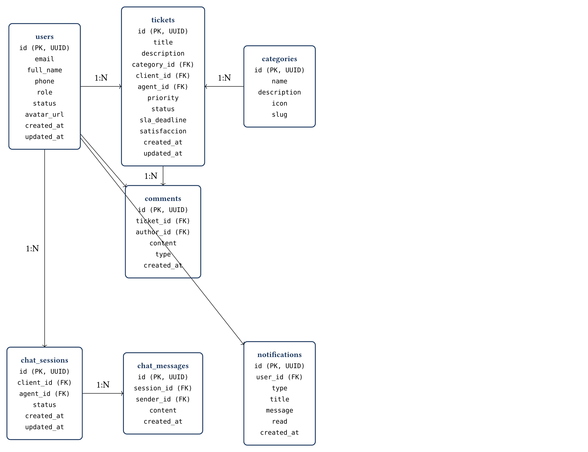

| Tabla | Propósito |
|-------|-----------|
| `users` | Perfiles (rol, estado, contacto). Se crea automáticamente al registrarse (trigger `on_auth_user_created`). |
| `categories` | Categorías de tickets (internet, telefonía, fibra, corporativo). |
| `tickets` | Tickets de soporte (estado, prioridad, SLA, cliente, agente). |
| `comments` | Comentarios de tickets (públicos / internos). |
| `knowledge_articles` | Artículos de la base de conocimiento (slug, vistas). |
| `chat_sessions` | Sesiones de chat (waiting / active / closed). |
| `chat_messages` | Mensajes de las sesiones de chat. |
| `notifications` | Notificaciones in-app para los usuarios. |

**Tipos ENUM:** `user_role`, `user_status`, `ticket_priority`, `ticket_status`, `comment_type`.

**Usuarios seed** (crear con `.venv/bin/python scripts/seed-users.py` — registra la cuenta en Auth y su perfil):

| Rol | Email | Password |
|-----|-------|----------|
| admin | `admin@soporte.com` | `Admin123!` |
| agent | `agente@soporte.com` | `Agente123!` |
| customer | `cliente@soporte.com` | `Cliente123!` |

---

## Chatbot Nivel 1 (Gemini AI)

El chatbot usa **IA real (Google Gemini `gemini-2.5-flash`)** para clasificar intenciones y generar respuestas contextuales, en lugar de reglas/regex. Se ejecuta mediante un workflow de n8n.

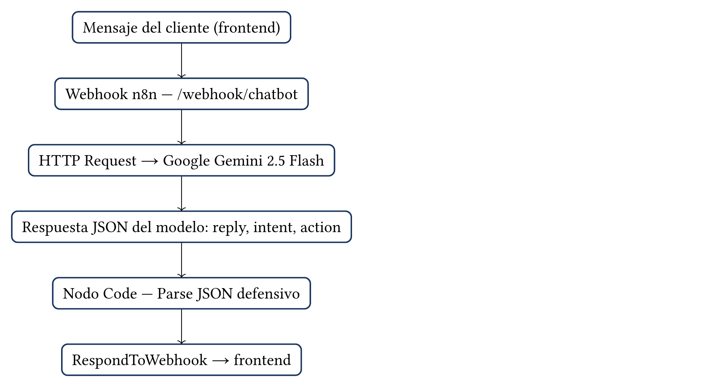

**Flujo:** `Frontend → Webhook n8n → HTTP Request (Gemini API) → Code (Parse JSON) → RespondToWebhook → Frontend`

### Intenciones soportadas

| Intención | Descripción |
|-----------|-------------|
| `greeting` | El usuario saluda |
| `check_ticket_status` | Consulta el estado de un ticket |
| `create_ticket` | Necesita crear un ticket |
| `faq` | Preguntas frecuentes (router, WiFi, saldo, factura, velocidad) |
| `business_hours` | Horario de atención y canales de contacto |
| `escalate_to_human` | Quiere hablar con un agente humano |
| `unknown` | Intención no determinada |

### Acciones

| Acción | Efecto |
|--------|--------|
| `redirect_tickets` | Redirige a la sección de tickets |
| `escalate` | Transfiere a un agente humano |
| `null` | Sin acción adicional |

> El `thinkingBudget` está en `0` para ahorrar tokens de razonamiento en consultas simples.

---

## Automatizaciones

### n8n (1 workflow)

| Workflow | Trigger | Acción |
|----------|---------|--------|
| Chatbot Nivel 1 | Webhook `POST /webhook/chatbot` | Gemini clasifica la intención y responde |

### Supabase nativo (PostgreSQL)

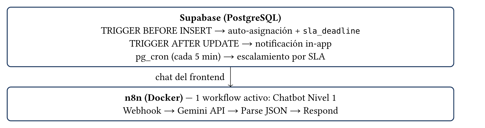

| Automatización | Tipo | Descripción |
|----------------|------|-------------|
| Auto-asignación | Trigger `BEFORE INSERT` | Asigna el agente activo con menor carga y fija `sla_deadline` |
| Notificación in-app | Trigger `AFTER UPDATE` | Notifica al cliente cuando cambia el estado del ticket |
| Escalamiento SLA | `pg_cron` (cada 5 min) | Escala a `urgent` los tickets que superaron su SLA |

---

## Roles y Seguridad

| Rol | Permisos |
|-----|----------|
| `customer` | Crear tickets, ver su historial, chat con bot/agente, base de conocimiento |
| `agent` | Atender tickets asignados, comentarios públicos/internos, gestionar chat |
| `supervisor` | Rol definido en el modelo (sin vista dedicada aún) |
| `admin` | Gestión completa: usuarios, categorías, SLA, reportes, KB |

- **Autenticación:** Supabase Auth (email/password).
- **Autorización:** Row Level Security (RLS) por rol en todas las tablas.
- **Protección de rutas:** middleware de Next.js valida la sesión y redirige a `/login`.

---

## Testing

Tests automatizados con **Vitest + React Testing Library** (entorno jsdom). La capa Supabase está mockeada, por lo que **no requieren base de datos ni servicios externos**.

```bash
npm test          # Ejecuta la suite (23 tests, ~2s)
npm run test:watch
```

```
tests/
├── mocks/supabase-mock.ts       # Mock de Supabase (query builder encadenable)
├── stores/authStore.test.ts     # Estado global de autenticación (4)
├── hooks/useAuth.test.ts        # Autenticación (3)
├── hooks/useTickets.test.ts     # Tickets: listar, filtrar, crear, actualizar (7)
├── hooks/useChat.test.ts        # Chat: sesión, historial, envío, creación (5)
└── components/ui.test.tsx       # Button y Badge (4)
```

La suite cubre requisitos funcionales clave (RF-001, RF-002, RF-005, RF-012) y no funcionales (RNF-010, RNF-011). Evidencia: `docsInformeSoporte/13-tests.typ`.

---

## Instalación

### Requisitos previos

- **Node.js 18+** y npm
- **Docker** (para n8n)
- Cuenta de **Supabase** (supabase.com)
- API key de **Google Gemini** (aistudio.google.com/apikey)

### 1. Clonar e instalar

```bash
git clone https://github.com/jjavdev/Soporte-Telecom.git
cd soporte-telecom
npm install
```

> El repo incluye `.npmrc` con `legacy-peer-deps=true` (necesario por un conflicto de peer deps en `shadcn`/`@babel`).

### 2. Variables de entorno

```bash
cp .env.example .env.local
# Editar .env.local con tus credenciales de Supabase y Gemini
```

### 3. Base de datos

En el **SQL Editor de Supabase**, ejecutar `supabase-setup.sql`. Esto crea:
- Los 5 tipos ENUM y las 8 tablas.
- Row Level Security (RLS) en todas las tablas.
- Triggers: `on_auth_user_created`, `updated_at`, auto-asignación y notificación.
- Función de escalamiento SLA + job `pg_cron` (requiere habilitar `pg_cron`).

Para habilitar el escalamiento:
1. Supabase → **Database → Extensions → `pg_cron`**.
2. Re-ejecutar la sección **10.3** de `supabase-setup.sql` para registrar el job `escalar-sla`.

### 4. n8n (chatbot)

```bash
cp .env.docker.example .env      # credenciales para Docker
docker compose up -d
```
Acceder a http://localhost:5678 → **Workflows → Import from File** → `n8n-workflows/04-chatbot-nivel1.json` → **Activar**.

### 5. Servidor de desarrollo

```bash
npm run dev        # http://localhost:3000
```

---

## Variables de Entorno

### App (`\.env.local`)

| Variable | Descripción | Requerida |
|----------|-------------|:---------:|
| `NEXT_PUBLIC_SUPABASE_URL` | URL del proyecto Supabase | Sí |
| `NEXT_PUBLIC_SUPABASE_ANON_KEY` | Anon key (pública) de Supabase | Sí |
| `NEXT_PUBLIC_N8N_WEBHOOK_URL` | URL del webhook de n8n (chatbot) | No* |
| `SUPABASE_SERVICE_KEY` | Service key (usada por n8n, no por la app) | No |
| `GEMINI_API_KEY` | API key de Gemini (usada por n8n) | No |

\* Si no se define, el chat muestra un mensaje amigable ("chatbot no disponible").

### Docker / n8n (`\.env`)

| Variable | Descripción |
|----------|-------------|
| `N8N_BASIC_AUTH_USER` | Usuario de acceso a n8n |
| `N8N_BASIC_AUTH_PASSWORD` | Contraseña de acceso a n8n |
| `SUPABASE_URL` | URL de Supabase para workflows |
| `SUPABASE_SERVICE_KEY` | Service key para workflows |
| `GEMINI_API_KEY` | API key de Gemini para el chatbot |

> **Nunca subas `.env` ni `.env.local`** al repositorio (ya están en `.gitignore`).

---

## Scripts Disponibles

| Comando | Descripción |
|---------|-------------|
| `npm run dev` | Servidor de desarrollo (puerto 3000) |
| `npm run build` | Build de producción |
| `npm run start` | Servidor de producción |
| `npm run lint` | ESLint |
| `npm test` | Tests (Vitest) |
| `npm run test:watch` | Tests en modo watch |
| `.venv/bin/python scripts/build-informe.py` | Genera el informe **PDF + DOCX** |
| `.venv/bin/python scripts/build-diagrams.py` | Compila los diagramas (Typst → PNG) |
| `.venv/bin/python scripts/capture-screenshots.py` | Captura las pantallas de la app (Playwright) |
| `.venv/bin/python scripts/capture-responsive.py` | Captura móvil/tablet/escritorio (Playwright) |
| `.venv/bin/python scripts/seed-users.py` | Crea/actualiza los usuarios seed (auth + perfil + rol) |
| `.venv/bin/python scripts/capture-test-screenshots.py` | Captura la ejecución de los tests |

---

## Despliegue

**Producción:** https://soporte-telecom.vercel.app

### Vercel (CLI)

```bash
vercel login
vercel env add NEXT_PUBLIC_SUPABASE_URL production --value "https://xxx.supabase.co" --type config --yes
vercel env add NEXT_PUBLIC_SUPABASE_ANON_KEY production --value "eyJ..." --type config --yes
vercel --prod
```

Notas:
- La anon key es **pública** por diseño → `--type config` (si no, el CLI la rechaza por parecer credencial).
- `.vercelignore` excluye `.codegraph`, `.venv`, `docs*`, `tests`, `scripts` del upload.
- `.npmrc` (`legacy-peer-deps=true`) permite el `npm install` en el build de Vercel.

### Alternativa: integración con GitHub
Conectar el repositorio en vercel.com para despliegue automático en cada push a `main`.

---

## Troubleshooting

**El chatbot no responde**
- Verificar que n8n esté corriendo: `docker compose ps`.
- Revisar `NEXT_PUBLIC_N8N_WEBHOOK_URL` en `.env.local`.
- Importar y **activar** `n8n-workflows/04-chatbot-nivel1.json`.
- En producción, n8n es local → el chatbot no es alcanzable (ver Limitaciones).

**Error de autenticación**
- Confirmar que `supabase-setup.sql` se ejecutó (trigger `on_auth_user_created`).
- Verificar credenciales de Supabase en `.env.local`.

**La app no compila**
```bash
npm run build
npx tsc --noEmit   # ver errores de TypeScript
```

**`npm install` falla con ERESOLVE**
- Confirmar que existe `.npmrc` con `legacy-peer-deps=true`.

**n8n no inicia**
```bash
docker compose logs n8n
```
Verificar que el archivo `.env` existe en la raíz con las credenciales.

**Los cambios no se reflejan en tiempo real**
- Verificar la suscripción Realtime en Supabase y que la tabla tenga replicación habilitada.

---

## Limitaciones conocidas

- **Chatbot en producción:** n8n corre en Docker local; el bot solo funciona en desarrollo o con un endpoint n8n público (`NEXT_PUBLIC_N8N_WEBHOOK_URL`). La app degrada con un mensaje amigable.
- **Exportación de reportes:** los reportes muestran métricas en pantalla; la exportación a PDF/CSV está planificada, no implementada.
- **Rol `supervisor`:** definido en el modelo, sin vista dedicada.
- **MFA:** los requisitos RNF-005 (MFA para agentes/admin) y RNF-006 (backups) no están implementados en esta versión.

---

## Documentación del Proyecto

El informe completo está en `../docsInformeSoporte/` (Typst), en 13 capítulos: elicitación, requisitos, historias de usuario, casos de uso, uso de IA, prototipo UI/UX, arquitectura general, arquitectura de BD, automatizaciones, evidencia, gestión de tokens, base de conocimiento y pruebas automatizadas.

Para regenerar el informe (PDF + DOCX):

```bash
.venv/bin/python scripts/build-informe.py
```

---

## Autores

**Jhordam Aguilera** — Ingeniería en Informática
**Profesora:** ING. Dubraska Roca — Ingeniería de Software I, CIVA 2026

## Licencia

Proyecto académico — Ingeniería de Software I.
